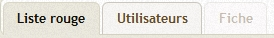
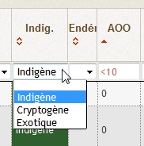

# Pour les utilisateurs

Bienvenue sur le wiki Codex pour les utilisateurs. Cette documentation s'applique à l'instance nationale déployé par la Fédération des conservatoire botanique nationaux. Elle reste cependant une base intéressante pour tout déploiement local de l'outil.

# Comment accéder à l'outil
## Nouvel utilisateur

Pour accéder à l'outil, il vous faut des identifiants de connexion.
Si vous souhaitez que l'on vous créer un compte sur l'outil, vous devez rentrer en contact avec l’administrateur de l'outil ou avec l'un des référents d'une rubrique de l'outil.
Afin de définir les différentes rubriques auxquelles vous pourrez avoir accès, rapprochez vous également des référents de votre structure.

## Utilisateur existant
### Récupérer ses identifiants de connexion
Si vous possédez déjà un compte sur l'outil, vous pouvez récupérer ces identifiants de connexion au niveau de la page d'accueil en appuyant sur le bouton "Récupérer mon mots de passe". Suivez la procédure et un mail vous sera en envoyé avec les informations nécessaire (l'adresse utilisée dans cette procédure doit être la même que celle utilisée lors de la création de votre compte).

### Changer de niveau de droit pour une rubrique
Si vous souhaitez accéder à une rubrique à laquelle vous n'avez pas accès, ou que vous souhaitez avoir un niveau de droit supérieur à celui que vous avez actuellement, vous devez en faire la demande au référent de votre structure correspondant ou par l'administrateur de l'outil en procédant.
Vous pouvez accédez à la liste des référents de votre structure dans dans la page "Administration", onglet "Utilisateur".

# Description d'une rubrique
Après vous être identifié, la page d'accueil vous présente les rubriques auxquels vous avez accès. Lorsque vous cliquez sur une rubrique, un tableau de synthèse apparaît.

## Onglet "tableau de synthèse"

Cet onglet (dans l'image ci-dessus appelé "Liste Rouge") présente un tableau synthétique donnant une vision d'ensemble des données disponibles sur la problématique en question.

### Filtrer sur le tableau de synthèse
Afin d'accéder à l'information que vous cherchez, des filtres de plusieurs types sont à votre disposition :
- liste de choix : certains filtres sont pré-établie en fonction des listes de valeurs utilisées en amont. Dans ce cas, il suffit de sélectionner la valeur d'intérêt et le tableau se mettra à jour.
- filtre textuel : ce filtre permet de réaliser une recherche textuel SANS CASSE, de toutes les lignes comprenant le texte spécifié dans le champ "filtre".
- filtre numérique : ce filtre permet de réaliser une recherche sur un champ numérique selon les conditions du tableau ci-dessous 

| Valeur du Filtre | Résultat de la recherche |
| -- | -- |
| 22 | toutes les lignes où le champ contient la valeur "22" (identique à un filtre textuel) |
| >22 | toutes les lignes où la valeur est supérieure à "22" |
| <22 | toutes les lignes où la valeur est inférieure à "22" |
| =22 | toutes les lignes où la valeur est égale à "22" |

### Trier le tableau de synthèse
Au niveau de l'en-tête de la colonne, il est possible de discerner le symbole . Ce symbole explicite que la colonne n'est pas utilisé par pour trier le tableau. Pour trier le tableau, il vous suffit de cliquer sur la colonne d'intérêt pour efectuer un trie croissant  ou un tri décroissant .

## L'onglet "utilisateurs"
Cet onglet est présent dans chaque rubrique. Il vous permet de connaitre les autres utilisateurs ayant accès à cette rubrique, et notamment connaitre leurs droits d'accès (niveau de droit et référent).

## Les fiches

# Comment remonter un bug